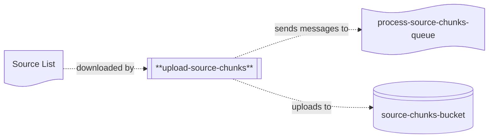

# upload-source-chunks

## Description

This repo contains the source code for the `upload-source-chunks` lambda, which is the first part of the Word List application's backend processing chain for updating word scores.



The `upload-source-chunks` lambda is responsible for retrieving a list of words from a source file at a known location, and splitting it into chunks.  Each chunk is uploaded to an S3 bucket, and a message is sent to a target queue with information about the chunk.

## Environment Variables

The lambda uses the following environment variables:

| Variable Name                  | Description                                                   |
|--------------------------------|---------------------------------------------------------------|
| SOURCES_TABLE_NAME             | Name of the DynamoDB table containing the source definitions. |
| SOURCE_CHUNKS_BUCKET_NAME      | Name of the bucket the chunks should be copied to.            |
| PROCESS_SOURCE_CHUNK_QUEUE_URL | Name of the queue to send process chunk messages to.          |

## Common Packages

This project uses the `lib-common` shared library which is published on GitHub.  To be able to import it, you'll need to use the following command:

```
dotnet nuget add source --username <your-username> --password <github-PAT> --store-password-in-clear-text --name github "https://nuget.pkg.github.com/word-list/index.json"
```